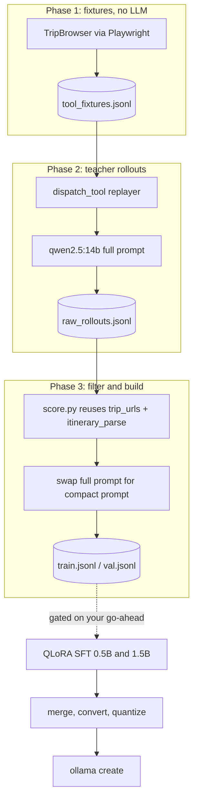

## Hardware reality check

Measured on your machine:

- RTX 3060 Laptop, **6 GB VRAM**; 16 GB system RAM; Python 3.12.10; `torch 2.5.1+cu121` with CUDA available
- Already pulled: `qwen2.5:3b` (current), `qwen2.5:7b`, `qwen3.5:9b`
- Teacher to pull: `qwen2.5:14b-instruct-q4_K_M` (~9.0 GB, so roughly 30 of 48 layers on GPU and the rest on CPU)
- Free disk: **C: 18 GB, D: 81.5 GB** — everything large must live on D:

Phase 0 therefore sets these before pulling anything, since both tools default to C:

```powershell
setx OLLAMA_MODELS "D:\ollama-models"
setx HF_HOME "D:\hf-cache"
```

Existing Ollama models can be moved by copying `C:\Users\22728\.ollama\models` to `D:\ollama-models`, or simply re-pulled.

## The finding that shapes the design

The fixed prompt overhead is **3,193 tokens** against `ollama_num_ctx = 4096`:

- `SYSTEM_PROMPT` in [travel_agent/agent.py](travel_agent/agent.py): 3,173 chars, ~793 tokens
- `TOOL_DEFINITIONS` in [travel_agent/browser_tools.py](travel_agent/browser_tools.py): 14 tools, 9,599 chars of JSON, ~2,399 tokens

That leaves under 900 tokens for live scrape results plus a ~768-token itinerary. So this is not only parameter distillation — it is **context distillation**. The teacher runs with the full prompt and full schemas; the student is trained to produce the same outputs from a compact prompt with trimmed tool descriptions. Fewer parameters and ~2,400 fewer prefill tokens compound into the speedup.



## Why fixtures come before the teacher

`tests/run_trip_examples_live.py` documents **5-15+ minutes per example** for a live scrape. Scraping once per teacher sample is impossible. Instead scrape each unique destination **once**, cache the raw `dispatch_tool` return strings, then replay them to the teacher with light perturbation (row shuffling, price and date jitter) so the student learns the mapping rather than memorizing listings. This also keeps Chromium out of memory while the 9 GB teacher is resident.

## New files

All new code lives in a `distill/` package so nothing in `travel_agent/` shifts until integration:

- `distill/session.py` — the shared 3-hour budget and resume harness every long phase runs on (unit keys, fsync'd JSONL append, SIGINT handling, ETA reporting)
- `distill/prompt_bank.py` — expand the 50 scenarios in [tests/trip_examples_50.py](tests/trip_examples_50.py) across nights, styles, budget, and `rent_car` into ~400 planner prompts via `build_plan_query()` from [travel_agent/planner_query.py](travel_agent/planner_query.py), plus refine-turn prompts mirroring the GUI refine path in [travel_agent/gui.py](travel_agent/gui.py)
- `distill/record_fixtures.py` — Phase 1 live scrape to `distill/data/tool_fixtures.jsonl`, resumable in the style of `_load_done_ids()`
- `distill/fixtures.py` — replay layer that monkeypatches `dispatch_tool(browser, name, args)` to serve cached output keyed by tool name plus normalized args
- `distill/teacher_rollout.py` — Phase 2, runs the real `TravelAgent.chat()` loop against the teacher, logging **every** LLM call as `(messages_prefix, tools) -> assistant_message`, capturing both tool-call turns and the final itinerary turn
- `distill/compact_prompt.py` — `COMPACT_SYSTEM_PROMPT` (target ~150 tokens) and `SLIM_TOOL_DEFINITIONS` (descriptions cut to one short line, target ~700 tokens)
- `distill/score.py` — rejection sampling using the repo's own validators
- `distill/build_dataset.py` — Phase 3, emits Qwen2.5 ChatML with tool calls
- `distill/train_sft.py` — Phase 4, **not run until you say so**
- `distill/export_gguf.py` and `distill/Modelfile.j2` — Phase 5
- `distill/bench.py` — Phase 6

## Quality filter reuses existing validators

This is what makes a small student viable — the repo already knows what a correct plan looks like. `distill/score.py` rejects a teacher sample when:

- `extract_booking_urls()` / `score_booking_url()` / `is_trusted_hotel_detail_url()` from [travel_agent/trip_urls.py](travel_agent/trip_urls.py) show an invented or list-page URL where a detail URL existed
- `parse_itinerary()` from [travel_agent/itinerary_parse.py](travel_agent/itinerary_parse.py) fails to recover all four sections
- The `Day N:` block count does not equal trip nights
- Any HK$ figure does not appear in the tool output text
- A vague line such as "Attractions & Tours" or "local dinner" survives

On roughly the top 30% of scenarios, sample the teacher twice at `temperature 0.7` and keep the higher-scoring completion (best-of-n distillation).

## Session model: stop at 3 hours, resume exactly where you left off

Every long-running phase shares one harness, `distill/session.py`, so no phase is a monolith you must babysit:

- **Unit of work.** Each phase commits progress in small units (one destination scrape, one rollout, one training checkpoint). A hard stop loses at most one unit, never the session.
- **Append-only JSONL with fsync.** Each finished unit is appended and flushed immediately, so even a power cut costs one unit. This extends the pattern already in [tests/run_trip_examples_live.py](tests/run_trip_examples_live.py), which uses `_load_done_ids()` against `progress.jsonl`.
- **Resume by key, not by index.** `--resume` reloads completed keys from the JSONL and skips them, so reordering or adding scenarios later does not redo old work.
- **Budget-aware stopping.** `--max-hours 3` (the default). Before starting a unit, the harness compares remaining budget against the moving-average unit time and stops early rather than beginning work it cannot finish.
- **Graceful Ctrl+C.** SIGINT finishes the current unit, flushes, and exits 0 instead of tearing down mid-write.
- **Session report on exit.** Each phase prints units done, average time per unit, estimated hours remaining, projected sessions left, and the exact resume command, for example: `python -m distill.teacher_rollout --resume --max-hours 3`.

Training resumes differently, through Hugging Face rather than the JSONL harness: `save_steps=100` with `save_total_limit=3`, relaunched via `resume_from_checkpoint=True`, plus a `TimeBudgetCallback` that sets `control.should_training_stop` and forces a save when the 3-hour budget is reached.

## Time estimates

Two kinds of work, and it helps not to conflate them. **Build steps** are me writing code (minutes to an hour each, no session budget needed). **Compute steps** are your machine grinding, and those are what the 3-hour sessions are for.

Compute steps, all with `--max-hours 3 --resume`:

- **Phase 0, environment**: ~1.5-2.5 h, one session. Redirect caches to D:, pull the 9 GB teacher (20-60 min depending on bandwidth), install training deps, set up llama.cpp binaries, and run a throughput smoke test. Not resumable, but short.
- **Phase 1, fixture scraping**: unit is one destination at 5-15 min, ~60 destinations, so **5-15 h (~8 h typical) across 2-5 sessions**. Playwright only, no LLM, so it can run while you do other things.
- **Phase 2, teacher rollouts**: the long pole. Unit is one rollout at **6-8 min** (roughly 265 s of decode at 3-5 tok/s for ~1,060 output tokens, plus ~60 s of incremental prefill). 300 rollouts plus best-of-2 on the top 30% is **36-46 h across 12-16 sessions**.
- **Phase 3, filter and dataset build**: ~15 min of compute over ~1,200 samples, plus 30-45 min of manual spot-checking. **~1 h, one session.**
- **Phase 4, training (gated)**: 0.5B LoRA ~1-1.5 h; 1.5B QLoRA ~2.5-3.5 h at roughly 3 s per micro-step. **~4-5 h across 2 sessions.**
- **Phase 5, export (gated)**: merge, convert, quantize, and `ollama create` for both students. **~1-1.5 h, one session.**
- **Phase 6, benchmark (gated)**: 4 configs over ~20 held-out scenarios, dominated by the teacher ceiling runs. **~3-4.5 h across 1-2 sessions.**

**Total: roughly 52-75 h, or 18-26 sessions of 3 hours.**

Two levers cut that materially, both built in as flags rather than plan rewrites:

- `--tool-turn-teacher qwen2.5:7b` keeps the 14B for itinerary turns (where quality matters) but drops tool-call turns from ~1 min to ~15 s, saving roughly 40% of Phase 2
- `--target-rollouts 200` instead of 300 trades dataset size for time

With both, Phase 2 falls to **18-24 h (6-8 sessions)** and the total to **~33-48 h, or 11-17 sessions**.

These are estimates from the 3-5 tok/s figure typical for a 9 GB model on 6 GB of VRAM. Phase 0 ends by measuring your actual decode and prefill rates and rewriting every number above from the measurement, so you can pick the levers with real data rather than my guess.

## Student configs, sized to 6 GB

Both trained, then benchmarked head to head:

- **Qwen2.5-0.5B-Instruct** — LoRA r=32 on a bf16 base, seq 4096, batch 1, grad accum 16, gradient checkpointing, ~3.5 GB peak
- **Qwen2.5-1.5B-Instruct** — QLoRA 4-bit NF4, r=32, paged AdamW 8-bit, seq 4096, ~5.2 GB peak; fall back to seq 3072 if it OOMs

Shared: `transformers` + `trl` `SFTTrainer` + `peft` + `bitsandbytes`, completion-only loss so only assistant tokens are scored, 3 epochs, lr 1e-4 cosine with 3% warmup, held-out validation split by **destination** rather than scenario so generalization is measured honestly.

## Export and integration

`merge_and_unload()` to fp16, then `llama.cpp/convert_hf_to_gguf.py`, then `llama-quantize` to Q4_K_M (also Q8_0 for the 0.5B, since it is tiny anyway), then `ollama create voyage-student-1_5b -f Modelfile` with the compact system prompt baked in via `SYSTEM` and a tool-capable `TEMPLATE`.

Integration is two small switches so the student and the current model can coexist:

- [travel_agent/config.py](travel_agent/config.py): add a `student_mode` setting alongside `fast_mode`
- [travel_agent/agent.py](travel_agent/agent.py): pick `COMPACT_SYSTEM_PROMPT` vs `SYSTEM_PROMPT` and `SLIM_TOOL_DEFINITIONS` vs `TOOL_DEFINITIONS`

`browser_tools.dispatch_tool` is untouched.

## Benchmark

`distill/bench.py` runs held-out scenarios against replayed fixtures so timing is deterministic, comparing student 0.5B, student 1.5B, `qwen2.5:3b` as the current baseline, and the 14B teacher as a quality ceiling:

- End-to-end plan wall time and tokens/sec, plus prefill token count
- Rate of correct first tool call (`propose_trip_route`) and overall tool-call JSON validity
- URL fidelity and day-count correctness
- Section-completeness via `parse_itinerary()`

Success target: 1.5B student at or above `qwen2.5:3b` quality with roughly 2x faster end-to-end plans; 0.5B accepted only if tool-call validity stays above 95%.

## Runbook: exact commands

You cannot train before the data exists, so the first four commands are prerequisites, each resumable on its own.

Phase 0, once (restart the terminal after `setx` so the variables take effect):

```powershell
setx OLLAMA_MODELS "D:\ollama-models"
setx HF_HOME "D:\hf-cache"
ollama pull qwen2.5:14b-instruct-q4_K_M
pip install -r requirements-distill.txt
python -m distill.calibrate
```

`calibrate` measures real decode and prefill throughput and prints a corrected schedule for the phases below.

Phase 1, fixtures, 2-5 sessions:

```powershell
python -m distill.record_fixtures --max-hours 3
python -m distill.record_fixtures --resume --max-hours 3
```

Phase 2, teacher rollouts, 12-16 sessions (or 6-8 with the escape hatches):

```powershell
python -m distill.teacher_rollout --max-hours 3 --target-rollouts 300
python -m distill.teacher_rollout --resume --max-hours 3
python -m distill.teacher_rollout --resume --max-hours 3 --tool-turn-teacher qwen2.5:7b
```

Phase 3, dataset, one short session:

```powershell
python -m distill.score
python -m distill.build_dataset --val-split-by destination
```

### Starting training (Phase 4, gated)

```powershell
python -m distill.train_sft --config distill/configs/student-0_5b.yaml --max-hours 3
python -m distill.train_sft --config distill/configs/student-1_5b.yaml --max-hours 3
```

Checkpoints land in `D:\distill-out\student-1_5b\checkpoint-<step>`. The 0.5B should finish inside a single session; the 1.5B will likely need two.

### Continuing training from a checkpoint

```powershell
python -m distill.train_sft --config distill/configs/student-1_5b.yaml --max-hours 3 --resume
```

`--resume` maps to `trainer.train(resume_from_checkpoint=True)`, which auto-selects the highest-numbered `checkpoint-N` in the output directory. To pin a specific one, for instance after a bad run:

```powershell
python -m distill.train_sft --config distill/configs/student-1_5b.yaml --resume-from D:\distill-out\student-1_5b\checkpoint-400
```

Two things worth understanding about training resume, because it is **not** the same mechanism as the JSONL phases:

- The JSONL phases resume by skipping completed keys. Training resume instead restores model weights, optimizer moments, LR scheduler position, RNG state, and dataloader position from `trainer_state.json`, so the loss curve continues rather than restarting.
- `TimeBudgetCallback` sets `should_save` **before** `should_training_stop`, so the moment the 3-hour budget expires becomes a checkpoint. You lose no steps to the clock. The `save_steps=100` interval is only insurance against a crash or power loss.

Confirm a resume worked by checking `global_step` in `D:\distill-out\student-1_5b\checkpoint-<step>\trainer_state.json`; it should continue upward rather than reset to 0.

If the 1.5B OOMs at 6 GB, drop the sequence length and restart that run from its last checkpoint:

```powershell
python -m distill.train_sft --config distill/configs/student-1_5b.yaml --max-seq-len 3072 --resume
```

Phases 5 and 6, gated:

```powershell
python -m distill.export_gguf --config distill/configs/student-1_5b.yaml
python -m distill.bench --models voyage-student-1_5b,voyage-student-0_5b,qwen2.5:3b --max-hours 3
```

## Risks

- **Teacher throughput** is the top risk and the whole schedule keys off it. Phase 0 measures it directly before any bulk generation, so the `--tool-turn-teacher` and `--target-rollouts` levers get pulled against real numbers. If decode lands nearer 3 tok/s than 5, expect the upper end of every Phase 2 estimate.
- **0.5B tool-call fidelity** is the likely failure mode; Ollama has no grammar constraint, so the mitigation is oversampling tool-call turns in the dataset
- **1.5B training at 4096 on 6 GB** is tight; seq 3072 is the fallback
- **Fixture staleness** — prices and dates drift, which the perturbation step deliberately exploits rather than fights
- **Disk is a hard constraint**: C: has only **18 GB free** while D: has **81.5 GB**. The pipeline needs roughly 40-60 GB (9 GB teacher, both HF bases in fp16, LoRA checkpoints, merged fp16 weights, GGUF plus quantized copies), and both Ollama and Hugging Face default to C:. Phase 0 must redirect storage to D: before anything is pulled.

## Gate

Phases 0-3 produce `train.jsonl` and `val.jsonl` and stop. `distill/train_sft.py` will be written but **not executed** until you explicitly ask.

Because of the session model, "stop" is never disruptive: end any session with Ctrl+C or let `--max-hours 3` expire, and the next session picks up at the next unit with a single `--resume`.